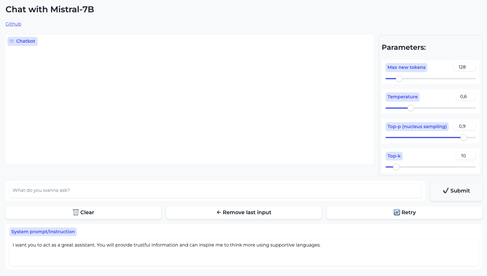

# Chat-with-Mistral-7B

This project aims to build a web interface for you as a user to chat with [Mistral-7B-Instruct-v0.1 ](https://huggingface.co/mistralai/Mistral-7B-Instruct-v0.1) and provides the following features:
- Easily change the [Instruction prompt](https://www.promptingguide.ai/models/mistral-7b#chat-template-for-mistral-7b-instruct) to instruct the model to generate accordingly.  
- Easily change the parameters for output generations.  
- Re-generates the output to observe (maybe)different outputs.
- Remove past conversations.

---
Reference:  
- https://www.promptingguide.ai/models/mistral-7b
- https://github.com/Shekswess/Mistral-7B-Healthcare